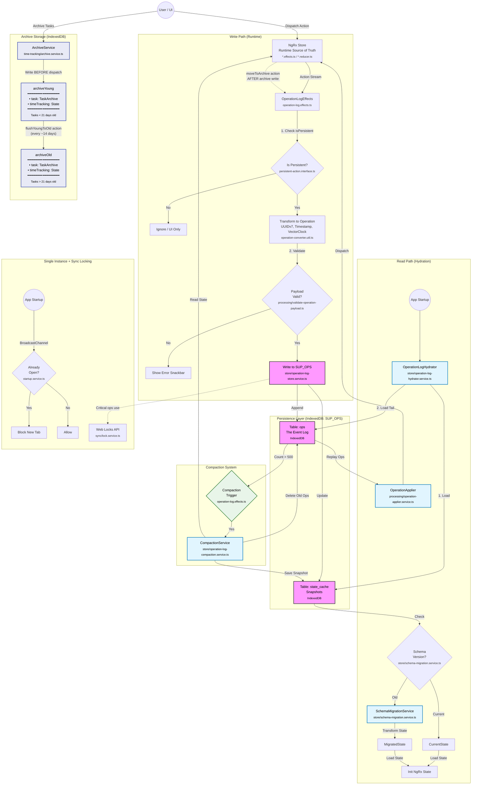

# 本地持久化架构

**最后更新：** 2026 年 1 月
**状态：** 已实现

本图展示了用户操作如何流经系统、如何持久化到 IndexedDB（`SUP_OPS`），以及系统在启动时如何完成恢复（hydration）。

## Operation Log 架构

## 归档数据流说明

- **先写归档，再 dispatch**：用户归档任务时，`ArchiveService` 会先写入 IndexedDB，再派发 `moveToArchive` action，确保状态变更前数据已安全落盘。
- **ArchiveModel 结构**：每层归档都存储 `{ task: TaskArchive, timeTracking: TimeTrackingState, lastTimeTrackingFlush: number }`。即归档任务实体和其时间追踪数据一并保存。
- **双层归档**：近期任务进入 `archiveYoung`（任务 < 21 天）；更早任务通过 `flushYoungToOld` 转入 `archiveOld`（在归档时约每 14 天检查一次）。
- **Flush 机制**：`flushYoungToOld` 是持久化 action，包含：
  1. 当 `moveTasksToArchiveAndFlushArchiveIfDue()` 期间检测到 `lastTimeTrackingFlush > 14 days` 时触发
  2. 将 `archiveYoung.task` 中超过 21 天的任务移动到 `archiveOld.task`
  3. 通过 operation log 同步，让所有客户端以确定性方式执行相同 flush
- **不存入 NgRx state**：归档数据直接存 IndexedDB，不放在 NgRx store。用于同步的是操作本身（`moveToArchive`、`flushYoungToOld`）。
- **同步处理**：在远端客户端上，`ArchiveOperationHandler` 会在收到操作后再写归档数据（见 [archive-operations.md](./06-archive-operations.md)）。

## 关键文件

| 文件                                                   | 作用                         |
| ------------------------------------------------------ | ---------------------------- |
| `op-log/effects/operation-log.effects.ts`              | 捕获 action 并写入 operation |
| `op-log/store/operation-log-store.service.ts`          | SUP_OPS 的 IndexedDB 封装    |
| `op-log/persistence/operation-log-hydrator.service.ts` | 启动恢复（hydration）        |
| `op-log/processing/operation-applier.service.ts`       | 将 operation 回放到 NgRx     |
| `features/time-tracking/archive.service.ts`            | 归档写入逻辑                 |
