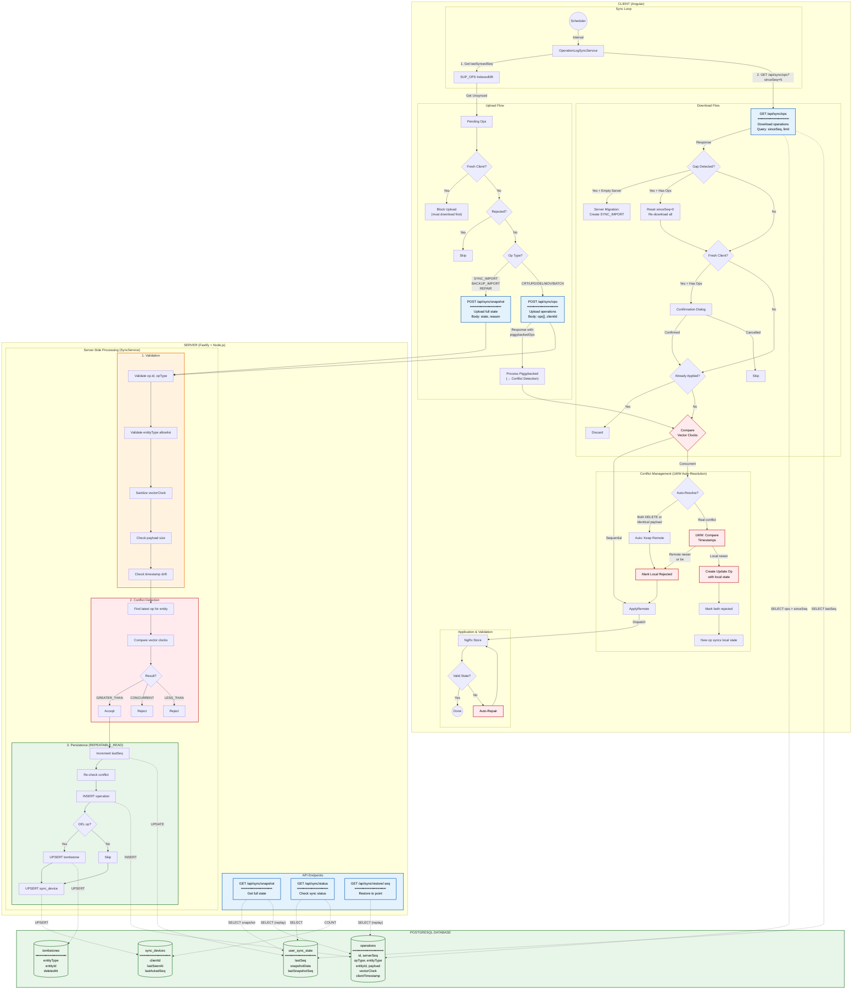
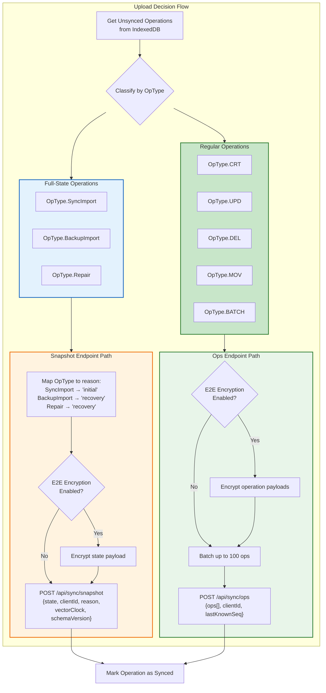
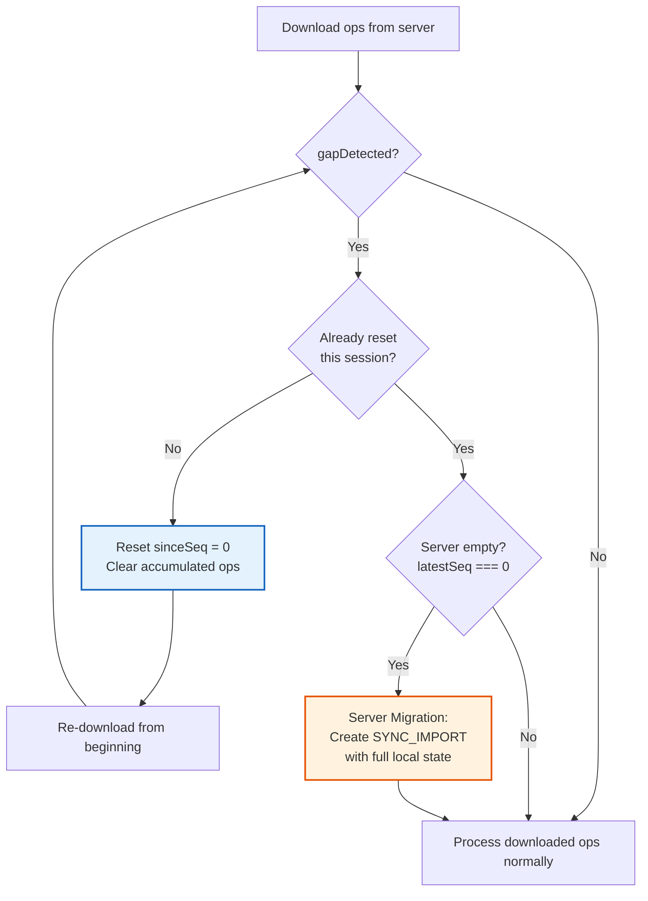

# 服务端同步架构（SuperSync）

**最后更新：** 2026 年 1 月  
**状态：** 已实现

本图展示了 SuperSync 的完整同步架构：客户端流程、服务端 API 端点、PostgreSQL 数据库操作以及服务端处理流程。

## 主架构图

## 快速参考表

### API 端点

| 端点                       | 方法 | 作用                        | 数据库操作                                                            |
| -------------------------- | ---- | --------------------------- | --------------------------------------------------------------------- |
| `/api/sync/ops`            | POST | 上传操作                    | INSERT ops, UPDATE lastSeq, UPSERT device, UPSERT tombstone（DEL 时） |
| `/api/sync/ops?sinceSeq=N` | GET  | 下载操作                    | SELECT ops, SELECT lastSeq, 查找最新快照（跳过优化）                  |
| `/api/sync/snapshot`       | POST | 上传全量状态（SYNC_IMPORT） | 同 POST /ops + UPDATE 快照缓存                                        |
| `/api/sync/snapshot`       | GET  | 获取全量状态                | SELECT snapshot（过期则回放 ops）                                     |
| `/api/sync/status`         | GET  | 查询同步状态                | SELECT lastSeq, COUNT devices                                         |
| `/api/sync/restore-points` | GET  | 列出恢复点                  | SELECT ops（过滤 SYNC_IMPORT/BACKUP_IMPORT/REPAIR）                   |
| `/api/sync/restore/:seq`   | GET  | 恢复到指定点                | SELECT ops，回放到 targetSeq                                          |

### PostgreSQL 表

| 表名              | 作用                      | 关键列                                                  |
| ----------------- | ------------------------- | ------------------------------------------------------- |
| `operations`      | 事件日志（append-only）   | id, serverSeq, opType, entityType, payload, vectorClock |
| `user_sync_state` | 用户级元数据 + 缓存快照   | lastSeq, snapshotData, lastSnapshotSeq                  |
| `sync_devices`    | 设备跟踪                  | clientId, lastSeenAt, lastAckedSeq                      |
| `tombstones`      | 删除实体跟踪（30 天保留） | entityType, entityId, deletedAt, expiresAt              |

### 关键实现细节

- **事务隔离级别：** `REPEATABLE_READ`，防止冲突检测中的幻读
- **双重冲突检查：** 分配序列号前后都检查一次（防竞态）
- **幂等性：** 重复 op ID 会返回 `DUPLICATE_OPERATION`
- **Gzip 支持：** 上传/下载都支持 `Content-Encoding: gzip`
- **限流：** 用户级限流（100 次上传/分钟，200 次下载/分钟）
- **同质冲突自动处理：** 两边都 DELETE 或 payload 相同，自动按 remote 解决
- **LWW 自动解决：** 真实冲突按时间戳走 Last-Write-Wins
- **新客户端安全：** 无历史客户端禁止上传，首次拉取远端前显示确认
- **Piggybacked Ops：** 上传响应携带新远端操作，立即处理并触发冲突检测
- **Gap 检测：** `gapDetected: true` 时客户端重置到 seq=0 全量重拉
- **服务端迁移：** Gap + 空服务器（无 ops）时，客户端创建 `SYNC_IMPORT` 初始化服务器
- **快照跳过优化：** 当 `sinceSeq < latestSnapshotSeq` 时，服务端可跳过快照前操作

## 通过 Snapshot 端点处理全量状态操作

`BackupImport`、`Repair`、`SyncImport` 这类全量状态操作会携带完整应用状态，可能超出普通 `/api/sync/ops` 的 body 限制（约 30MB），因此会走 `/api/sync/snapshot`。

## Gap 检测

Gap 检测用于识别“无法可靠增量同步、必须纠偏”的场景。

### 四类 Gap 场景

| 场景 | 条件                              | 含义                     | 常见原因             |
| ---- | --------------------------------- | ------------------------ | -------------------- |
| 1    | `sinceSeq > 0 && latestSeq === 0` | 客户端有历史，服务器为空 | 服务器被重置/迁移    |
| 2    | `sinceSeq > latestSeq`            | 客户端序列领先服务端     | 服务端从旧备份恢复   |
| 3    | `sinceSeq < minSeq - 1`           | 请求的操作已被清理       | 保留策略删除了旧操作 |
| 4    | `firstOpSeq > sinceSeq + 1`       | 序列号出现断层           | 数据库损坏或人工删除 |

### 客户端处理流程

## 关键文件

| 文件                                                    | 作用                   |
| ------------------------------------------------------- | ---------------------- |
| `src/app/op-log/sync/operation-log-sync.service.ts`     | 同步编排主入口         |
| `src/app/op-log/sync/operation-log-upload.service.ts`   | 上传逻辑               |
| `src/app/op-log/sync/operation-log-download.service.ts` | 下载逻辑               |
| `src/app/op-log/sync/conflict-resolution.service.ts`    | LWW 冲突解决           |
| `src/app/op-log/sync/server-migration.service.ts`       | 服务端迁移（空服务器） |
| `packages/super-sync-server/src/sync/`                  | 服务端同步实现         |
