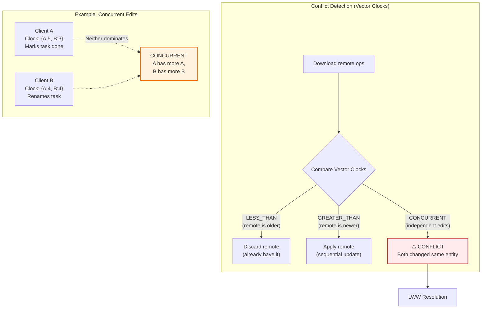
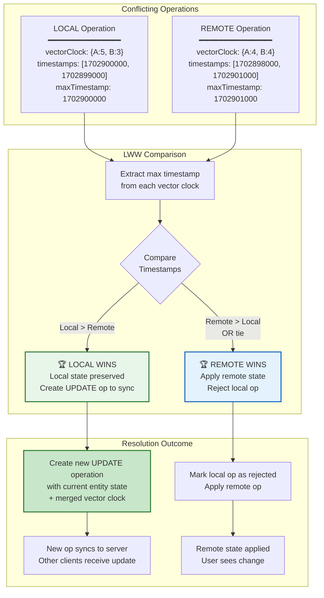
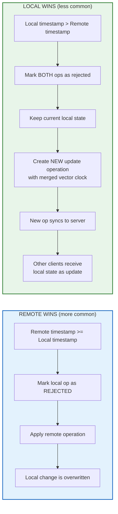
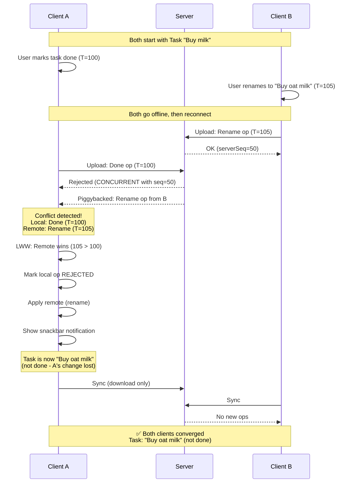
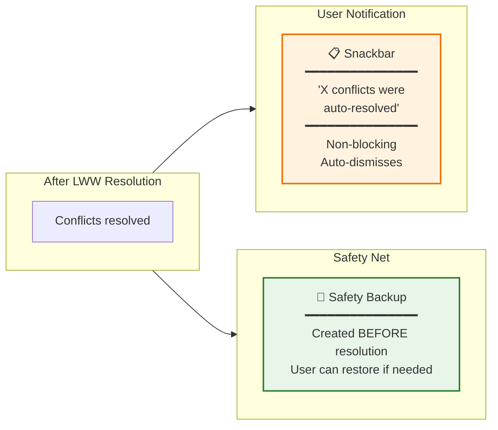
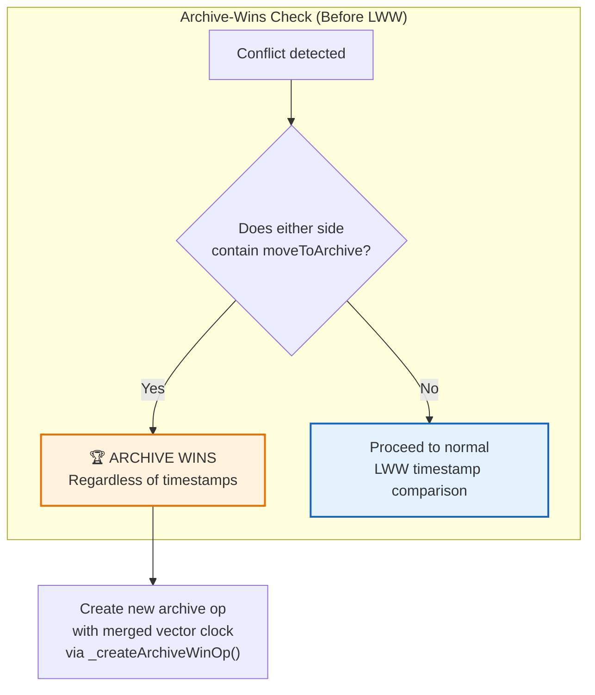
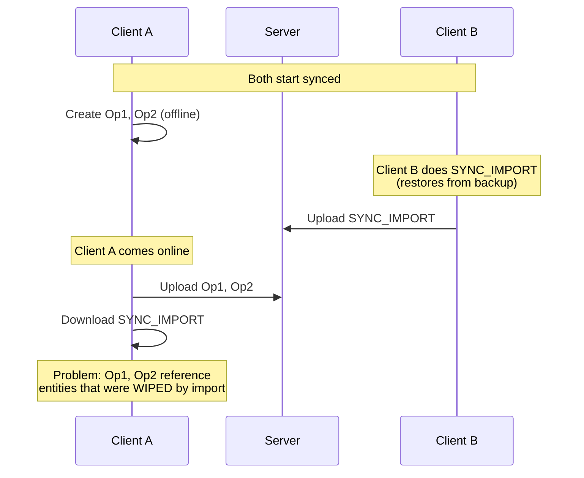
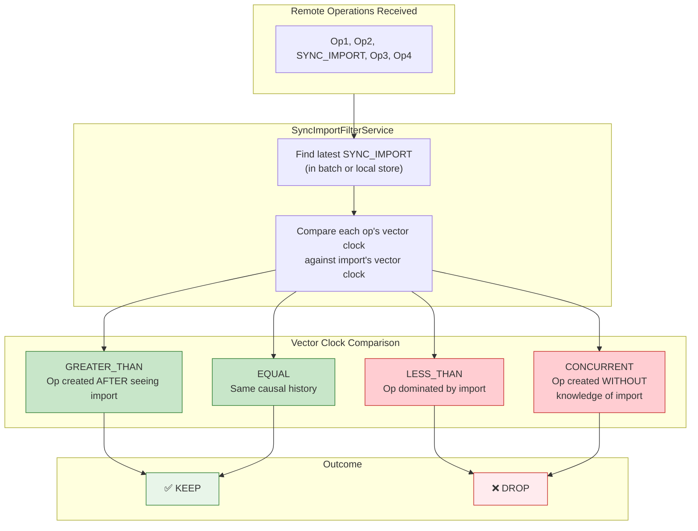
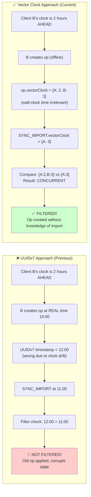

# 冲突解决与 SYNC_IMPORT 过滤

**最后更新：** 2026 年 2 月  
**状态：** 已实现

本文档涵盖 LWW（Last-Write-Wins）自动冲突解决，以及带“清空重建（clean slate）语义”的 SYNC_IMPORT 过滤机制。

## LWW 自动冲突解决

当两个客户端并发修改同一实体时会产生冲突。系统不会弹窗打断用户，而是基于操作时间戳用 **LWW** 自动裁决。

### 什么是冲突？

当向量时钟比较结果是 `CONCURRENT` 时即为冲突，即双方都不是“先于”对方的操作，代表独立并发编辑。

### LWW 解决算法

系统会比较每个操作向量时钟中的**最大时间戳**。较晚者胜出；若相同则 remote 胜（保证收敛）。

### 两种可能结果

### 完整 LWW 流程

### 用户提示

### 归档优先例外（Archive-Wins）

当 `moveToArchive` 与字段级更新（重命名、时间追踪等）冲突时，**归档永远胜出**，与时间戳无关。因为归档代表明确用户意图，不应被反向恢复。

**为什么要这样？** 若没有此规则，并发字段更新在 LWW 中可能“复活”已归档任务（把状态写回 active store）。Archive-Wins 是第一层防线，`bulkOperationsMetaReducer` 是第二层防线（见 [06-archive-operations.md](./06-archive-operations.md)）。

### 关键实现细节

| 项目             | 实现                                           |
| ---------------- | ---------------------------------------------- |
| **时间戳来源**   | `Math.max(...Object.values(vectorClock))`      |
| **平局规则**     | remote 胜（保证所有客户端最终收敛）            |
| **归档例外**     | `moveToArchive` 优先于字段更新，跳过时间戳比较 |
| **安全备份**     | 通过 `BackupService` 在解决前创建              |
| **本地胜出更新** | 生成新 `OpType.UPD`，并携带合并后向量时钟      |
| **向量时钟合并** | `mergeVectorClocks(localClock, remoteClock)`   |
| **实体状态读取** | 通过实体选择器从 NgRx store 读取               |
| **用户提示**     | 非阻塞 snackbar，展示自动解决数量              |

---

## 带 Clean Slate 语义的 SYNC_IMPORT 过滤

当收到 `SYNC_IMPORT`/`BACKUP_IMPORT` 时，表示用户明确发起“恢复到某个时间点”。系统会通过向量时钟过滤掉所有“在不知道这次导入的前提下产生”的操作。

### 问题：导入后的过期操作

### 方案：Clean Slate 语义

`SYNC_IMPORT/BACKUP_IMPORT` 表示“以此状态为新起点”。**所有不知道这次导入的操作都应丢弃**，从而实现真正的时间点恢复语义。

这里必须用**向量时钟比较**（而不是 UUIDv7 时间戳），因为向量时钟表示的是**因果关系**（创建操作时是否知道这次导入），而墙钟时间会受设备时钟漂移影响。

### 向量时钟比较结果

| 比较结果       | 含义                   | 处理                   |
| -------------- | ---------------------- | ---------------------- |
| `GREATER_THAN` | 该操作创建时已知道导入 | ✅ 保留                |
| `EQUAL`        | 与导入处于同一因果历史 | ✅ 保留                |
| `LESS_THAN`    | 被导入状态支配         | ❌ 丢弃                |
| `CONCURRENT`   | 创建时不知道导入       | ❌ 丢弃（clean slate） |

### 为什么不用 UUIDv7？

向量时钟追踪的是**因果关系**（是否“知道导入”）。UUIDv7 只反映墙钟时间，设备间时钟漂移会导致误判。

## 关键文件

| 文件                                                           | 作用                             |
| -------------------------------------------------------------- | -------------------------------- |
| `src/app/op-log/sync/conflict-resolution.service.ts`           | LWW 自动冲突解决                 |
| `src/app/op-log/sync/rejected-ops-handler.service.ts`          | 处理服务端拒绝、卡住冲突重试上限 |
| `src/app/op-log/sync/superseded-operation-resolver.service.ts` | 生成带合并向量时钟的替代操作     |
| `src/app/op-log/sync/sync-import-filter.service.ts`            | SYNC_IMPORT 过滤逻辑             |
| `src/app/op-log/sync/operation-log-download.service.ts`        | 下载并应用远端操作               |
| `src/app/op-log/sync/vector-clock.service.ts`                  | 向量时钟比较工具                 |
