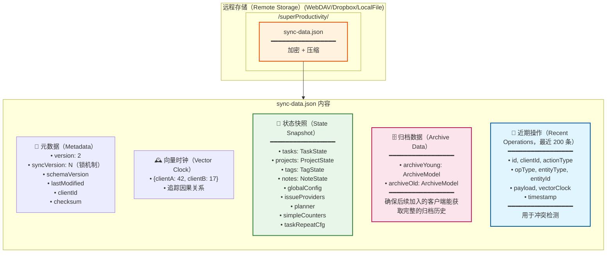
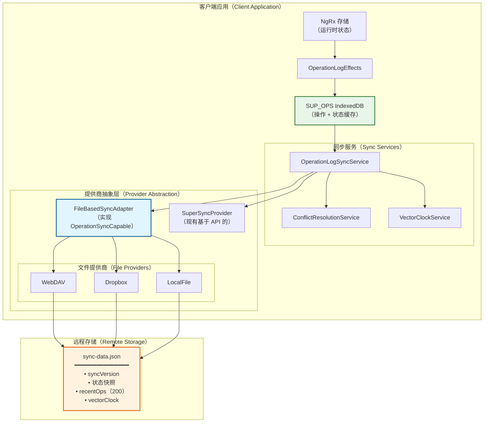
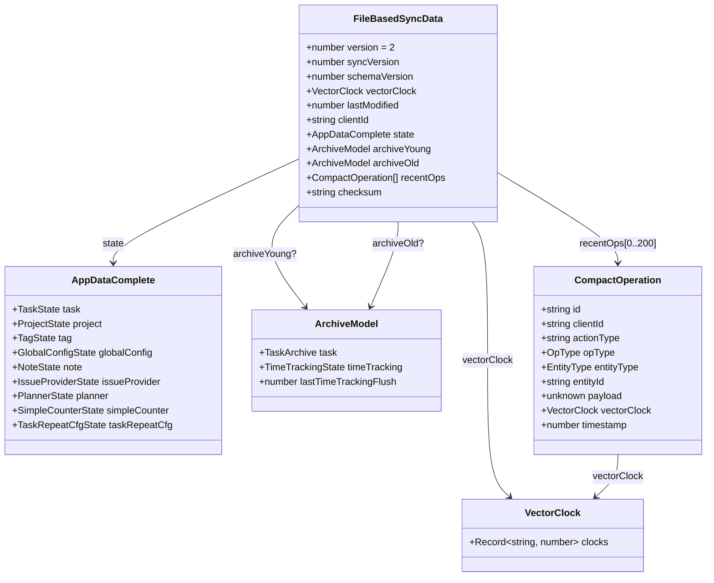
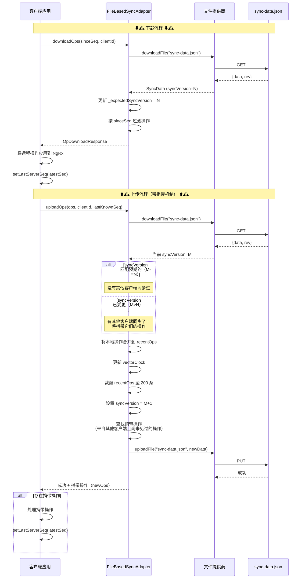
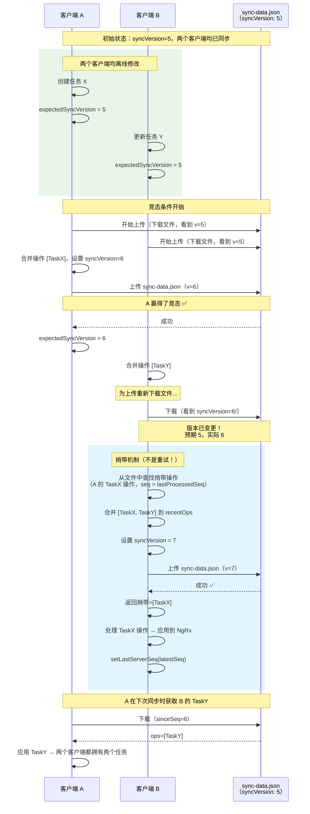
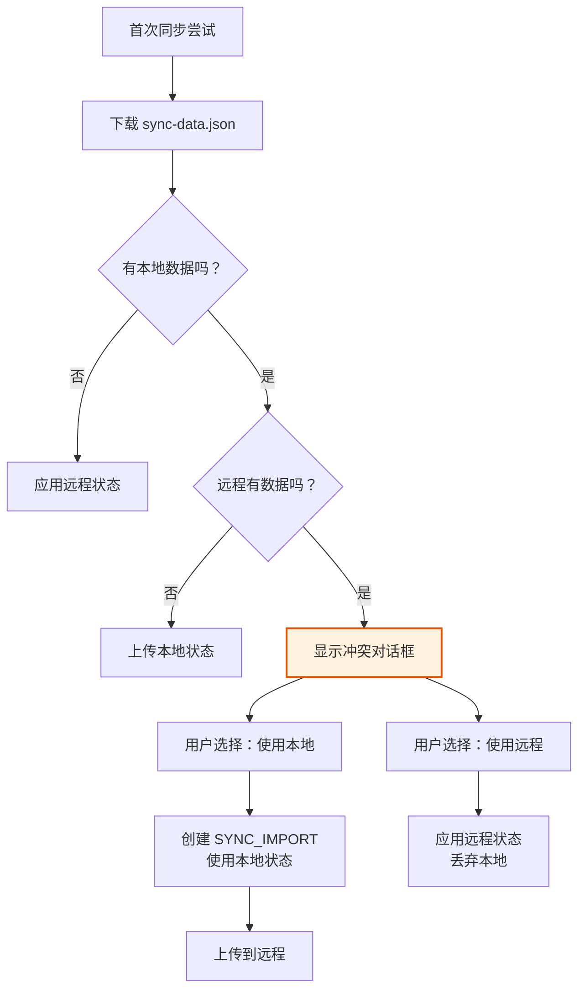
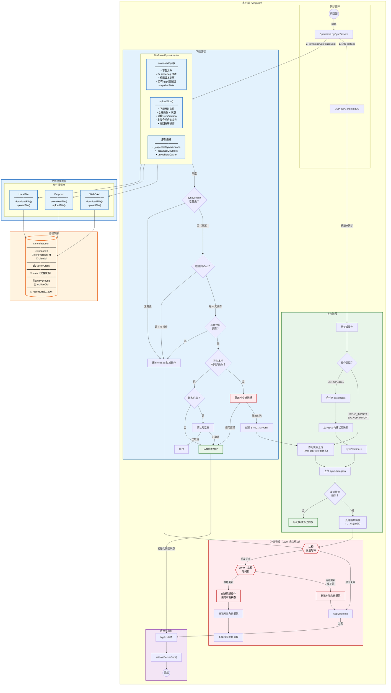

# 文件型同步架构（File-Based Sync Architecture）

**最后更新：** 2026 年 1 月
**状态：** 已实现

本文档包含说明文件型提供商（WebDAV、Dropbox、LocalFile）统一操作日志同步架构的图表。

## 概述

文件型同步使用单个 `sync-data.json` 文件，其中包含：

- 完整的应用状态快照
- 近期操作缓冲区（最近 200 条操作）
- 用于冲突检测的向量时钟（Vector Clock）
- 供后续加入客户端使用的归档数据

### 为什么选择单文件而非分离的快照 + 操作文件？

| 单文件（已选）                | 双文件（曾考虑）                |
| --------------------------- | --------------------------- |
| 原子性：全有或全无            | 存在部分上传风险                |
| 只需跟踪一个版本              | 需要版本协调                   |
| 冲突解决简单                  | 需要在两处处理                 |
| 易于恢复                     | 可能出现不一致状态              |
| 每次上传完整状态              | 通常只上传操作                  |

带宽成本是可接受的：状态压缩效果好（约 90%），且同步频率不高。

## 架构总览

展示 `FileBasedSyncAdapter` 如何集成到现有的操作日志系统中，通过文件操作实现 `OperationSyncCapable` 接口。

## TypeScript 类型

## 同步流程（基于内容的乐观锁，附带捎带机制）

### 核心洞察：捎带机制（Piggybacking）

版本不匹配时不会抛出错误，而是由适配器：

1. 将本地操作与文件中的操作合并
2. 将其他客户端的操作作为 `newOps`（捎带操作）返回
3. 上传服务在更新 `lastServerSeq` 之前先处理这些操作

这确保了即使客户端并发同步，也不会遗漏任何操作。

## 冲突解决（两个客户端同时同步）

### 捎带机制如何解决冲突

| 步骤                             | 发生的行为                                                   |
| -------------------------------- | ----------------------------------------------------------- |
| 1. 检测到版本不匹配              | B 预期 v=5，实际找到 v=6                                      |
| 2. 无需重试                      | B 继续进行合并                                                |
| 3. 查找捎带操作                  | 文件中 seq > lastProcessedSeq 且来自其他客户端的操作            |
| 4. 合并并上传                    | B 的操作 + 文件中的操作 → 新文件                               |
| 5. 返回捎带操作                  | 上传响应中包含 A 的操作                                         |
| 6. 处理捎带操作                  | 上传服务在推进 lastServerSeq 之前应用这些操作                    |

**同一实体上的 LWW（最后写入者胜出）：**

如果 A 和 B 都修改了同一任务，捎带操作会通过 `ConflictResolutionService` 处理，该服务使用向量时钟和时间戳来决定胜者。

## 首次同步冲突处理

当本地已有数据的客户端首次同步到已存在远程数据的服务端时，会显示冲突对话框：

## 主架构图

## 快速参考表

### 文件操作

| 操作     | 方法                    | 目的               | 关键步骤                                                              |
| -------- | ----------------------- | ------------------ | --------------------------------------------------------------------- |
| 下载     | `downloadOps()`         | 获取远程变更        | 下载文件 → 按 sinceSeq 过滤 → 检测 gap → 返回操作或快照                 |
| 上传     | `uploadOps()`           | 推送本地变更        | 下载当前文件 → 合并操作 → 递增 syncVersion → 上传 → 返回捎带操作        |
| 获取序列 | `getLastServerSeq()`    | 获取已处理的序列     | 从 `_localSeqCounters` 映射中读取                                      |
| 设置序列 | `setLastServerSeq()`    | 更新已处理的序列     | 写入 `_localSeqCounters` + 持久化                                      |

### sync-data.json 结构

| 字段             | 类型                  | 目的                                    |
| ---------------- | --------------------- | --------------------------------------- |
| `version`        | `2`                   | 文件格式版本                             |
| `syncVersion`    | `number`              | 基于内容的锁计数器（每次上传递增）          |
| `schemaVersion`  | `number`              | 应用数据模式版本（用于迁移）               |
| `clientId`       | `string`              | 最后修改文件的客户端                       |
| `lastModified`   | `number`              | 最后修改时间戳                           |
| `vectorClock`    | `VectorClock`         | 所有操作的因果顺序                        |
| `state`          | `AppDataComplete`     | 完整的应用状态快照                        |
| `archiveYoung`   | `ArchiveModel?`       | 归档 < 21 天的任务                       |
| `archiveOld`     | `ArchiveModel?`       | 归档 > 21 天的任务                       |
| `recentOps`      | `CompactOperation[]`  | 最近 200 条操作（用于冲突检测）            |
| `checksum`       | `string?`             | 未压缩状态的 SHA-256 哈希                 |

### 关键实现细节

| 特性                 | 实现方式                                                                  |
| -------------------- | ------------------------------------------------------------------------- |
| **乐观锁**           | `syncVersion` 计数器——无需服务器 ETag                                      |
| **Gap 检测**         | syncVersion 重置或快照替换触发从 seq=0 重新下载                             |
| **捎带机制**         | 上传时，其他客户端的操作（seq > lastProcessed）作为 `newOps` 返回             |
| **首次同步冲突**     | 本地未同步操作 + 远程快照 → 显示冲突对话框                                   |
| **新客户端安全**     | 接受第一个远程数据前显示确认对话框                                            |
| **LWW 冲突**        | 并发向量时钟 → 比较时间戳 → 较晚者胜                                          |
| **快照引导**         | 检测到 gap + 存在快照 → 从完整状态初始化（跳过操作）                           |
| **缓存优化**         | 下载的同步数据被缓存，避免上传前重复下载                                      |
| **归档同步**         | 归档数据嵌入文件中；`ArchiveOperationHandler` 写入 IndexedDB                  |

## 关键要点

1. **单同步文件**：所有数据在 `sync-data.json` 中——状态快照 + 近期操作 + 向量时钟
2. **基于内容的版本控制**：`syncVersion` 计数器无需服务器 ETag 即可检测冲突
3. **上传捎带机制**：版本不匹配不抛出错误——其他客户端的操作作为 `newOps` 返回
4. **序列计数器分离**：
   - `_expectedSyncVersions`：跟踪文件的 syncVersion（用于版本不匹配检测）
   - `_localSeqCounters`：跟踪已处理的操作（通过 `setLastServerSeq` 更新）
5. **通过操作日志归档**：归档操作同步；`ArchiveOperationHandler` 写入数据
6. **确定性重放**：相同操作 + 相同时间戳 = 各处相同结果

## 实现文件

| 文件                                                                               | 用途                            |
| ---------------------------------------------------------------------------------- | ------------------------------- |
| `src/app/op-log/sync-providers/file-based/file-based-sync-adapter.service.ts`      | 主适配器（约 800 行）            |
| `src/app/op-log/sync-providers/file-based/file-based-sync.types.ts`                | TypeScript 类型和常量            |
| `src/app/op-log/sync-providers/file-based/file-based-sync-adapter.service.spec.ts` | 单元测试                         |
