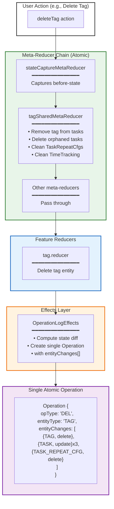
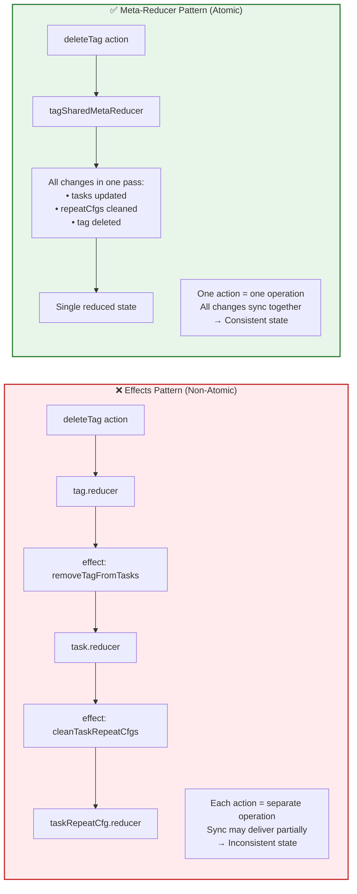
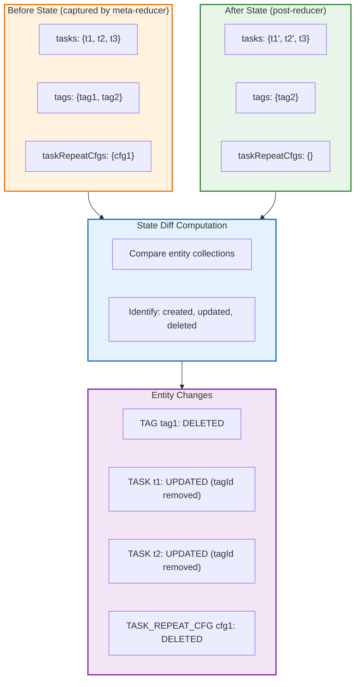
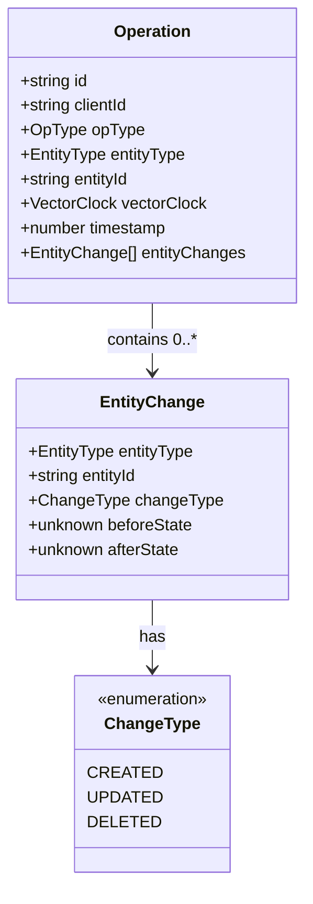
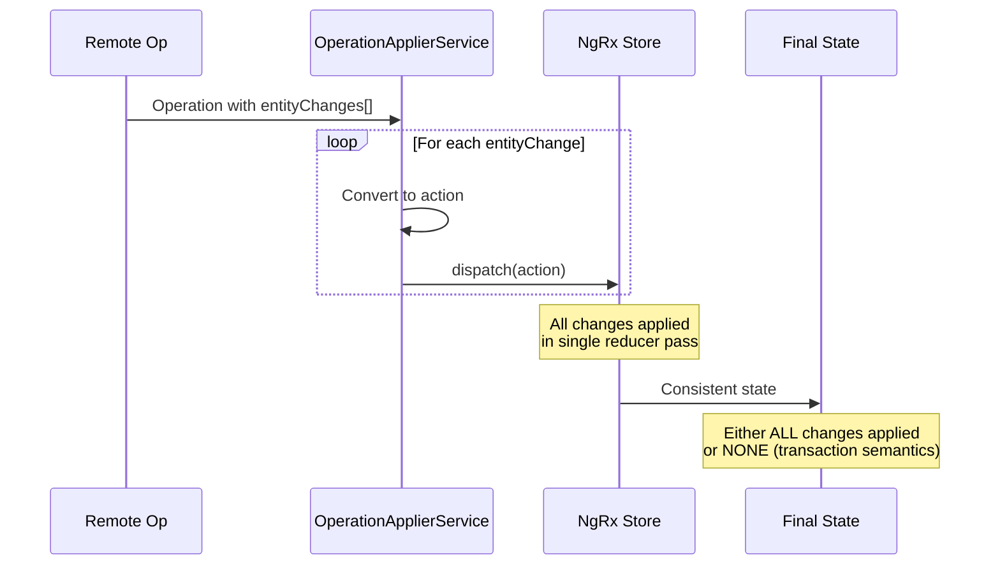
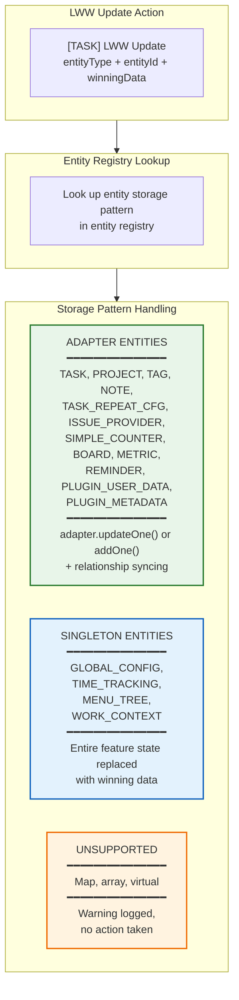

# 原子状态一致性（Meta-Reducer 模式）

**最后更新：** 2026 年 1 月  
**状态：** 已实现

本文展示 meta-reducer 如何在多实体变更中保证原子状态一致性，避免同步过程中的中间态不一致。

## 多实体操作的 Meta-Reducer 流程

## 为什么用 Meta-Reducer 而不是 Effects

## 状态变更检测

`StateChangeCaptureService` 通过比较前后状态计算实体变更：

## 使用 Meta-Reducer 的多实体操作

| Action              | 影响实体                                                 | Meta-Reducer               |
| ------------------- | -------------------------------------------------------- | -------------------------- |
| `deleteTag`         | Tag, Tasks（移除 tagId）, TaskRepeatCfgs, TimeTracking   | `tagSharedMetaReducer`     |
| `deleteTags`        | Tags, Tasks, TaskRepeatCfgs, TimeTracking                | `tagSharedMetaReducer`     |
| `deleteProject`     | Project, Tasks（级联删除）, TaskRepeatCfgs, TimeTracking | `projectSharedMetaReducer` |
| `convertToMainTask` | Parent task, Child task, Sub-tasks                       | `taskSharedMetaReducer`    |
| `moveTaskUp/Down`   | 多个任务（重排）                                         | `taskSharedMetaReducer`    |

## 带 Entity Changes 的 Operation 结构

## 同步回放：全有或全无

远端操作应用时，所有 entity changes 会被原子回放：

## LWW Update Meta-Reducer：实体类型处理

`lwwUpdateMetaReducer` 用于处理 LWW 胜出后创建的 Update action。它区分三类实体存储模式：

### Adapter 实体细节

对于 adapter-backed 实体，meta-reducer 处理两种情况：

| 条件                  | 行为                                      | 原因                                                 |
| --------------------- | ----------------------------------------- | ---------------------------------------------------- |
| 实体在 store 中存在   | `adapter.updateOne()`：用胜出数据替换实体 | 常规冲突解决                                         |
| 实体在 store 中不存在 | `adapter.addOne()`：重建实体              | 处理 DELETE vs UPDATE 竞态（本地删了但远端更新胜出） |

### Task 关系同步

LWW 更新 task 后，meta-reducer 会同步相关引用：

| 变更字段    | 同步关系                                                   |
| ----------- | ---------------------------------------------------------- |
| `projectId` | 更新 `project.taskIds`（新旧项目成员关系）                 |
| `tagIds`    | 对新增/移除标签同步 `tag.taskIds`                          |
| `dueDay`    | 更新 `TODAY_TAG.taskIds`（虚拟标签，成员由 `dueDay` 决定） |
| `parentId`  | 更新新旧父任务的 `parent.subTaskIds`                       |

**关键文件：** `src/app/root-store/meta/task-shared-meta-reducers/lww-update.meta-reducer.ts`

## 关键文件

| 文件                                                                           | 作用                                          |
| ------------------------------------------------------------------------------ | --------------------------------------------- |
| `src/app/root-store/meta/task-shared-meta-reducers/`                           | 任务相关多实体变更                            |
| `src/app/root-store/meta/task-shared-meta-reducers/tag-shared.reducer.ts`      | 标签删除与关联清理                            |
| `src/app/root-store/meta/task-shared-meta-reducers/project-shared.reducer.ts`  | 项目删除与关联清理                            |
| `src/app/root-store/meta/task-shared-meta-reducers/lww-update.meta-reducer.ts` | LWW Update 处理（adapter/singleton/关系同步） |
