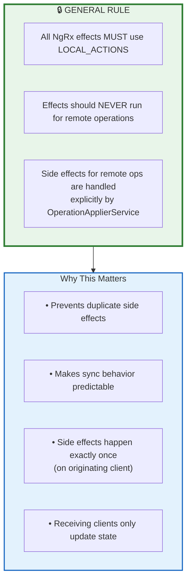
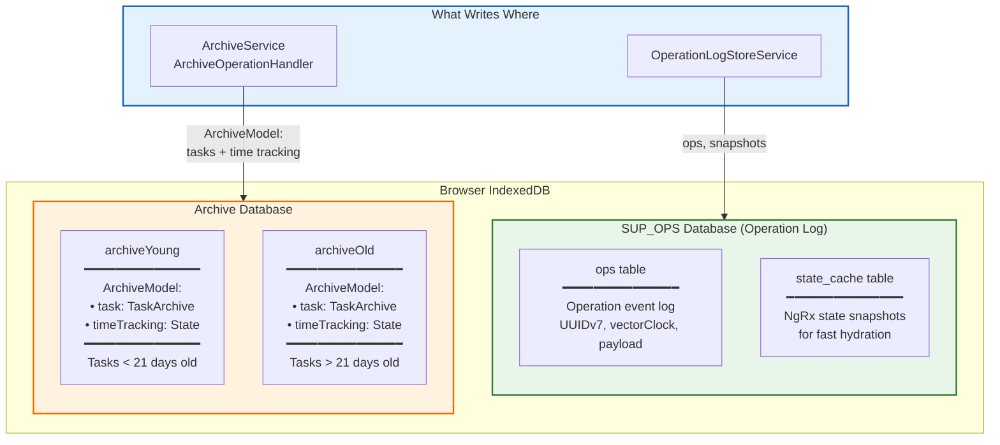
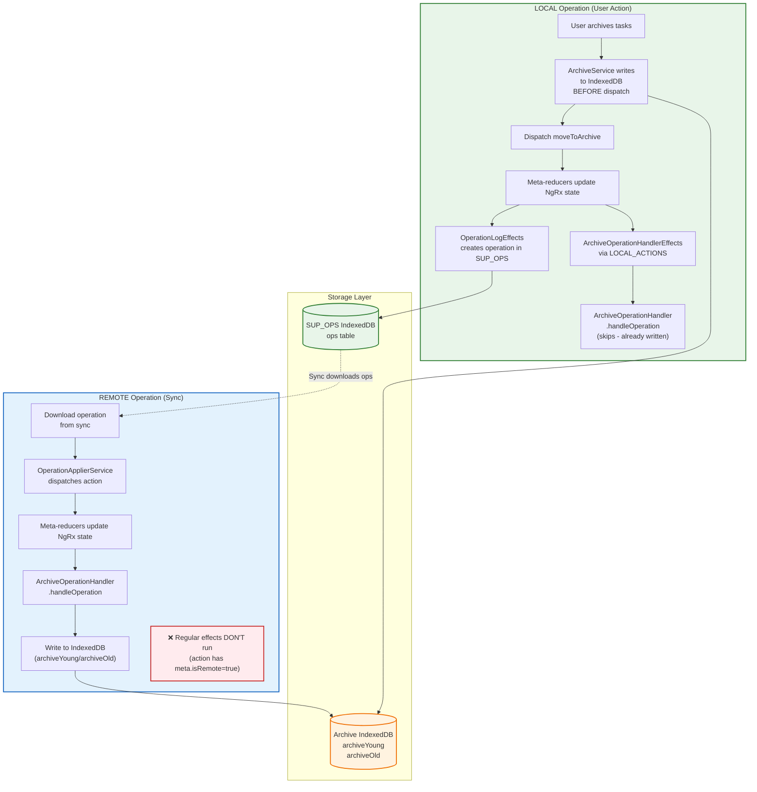
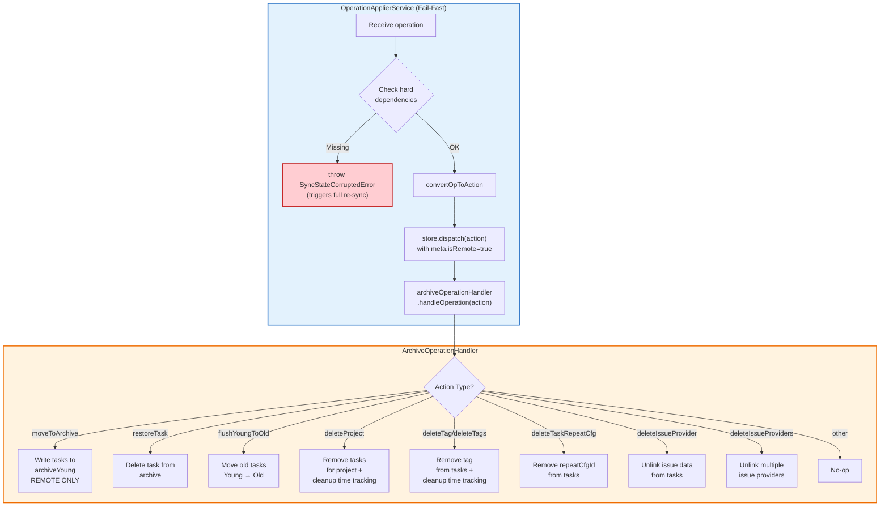
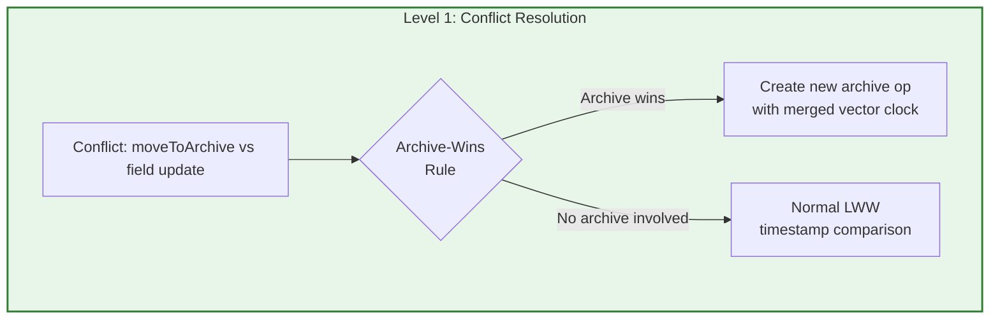
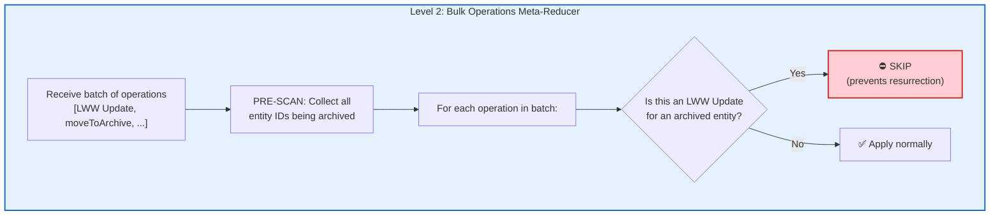

# 归档操作与副作用

**最后更新：** 2026 年 1 月  
**状态：** 已实现

本节说明归档相关副作用如何处理，并建立一条通用规则：**远端操作不应触发普通 effects**。

## 通用规则：Effects 只处理本地动作

## 双数据库架构

Super Productivity 使用两个独立的 IndexedDB 数据库：

**关键点：**

| 数据库     | 作用                 | 写入方                                      |
| ---------- | -------------------- | ------------------------------------------- |
| `SUP_OPS`  | 操作日志（事件溯源） | `OperationLogStoreService`                  |
| Archive DB | 归档数据、时间追踪   | `ArchiveService`, `ArchiveOperationHandler` |

## 归档操作流程

归档数据存放在独立 IndexedDB 中，**不在** NgRx state 与 operation log payload 内，因此需要通过统一的 `ArchiveOperationHandler` 特殊处理：

- **本地操作：** `ArchiveOperationHandlerEffects` 经由 `LOCAL_ACTIONS` 路由到 `ArchiveOperationHandler`
- **远端操作：** `OperationApplierService` 在 dispatch 后直接调用 `ArchiveOperationHandler`

两条路径都走同一处理器，以保证行为一致。

## ArchiveOperationHandler 集成

`OperationApplierService` 采用 **fail-fast**：若硬依赖缺失，直接抛 `SyncStateCorruptedError`，触发全量重同步。相比复杂重试，这样更安全。

**为什么 Fail-Fast？**

服务端保证按序下发操作，删除动作也由 meta-reducer 保障原子性。若依赖缺失，说明同步状态根本异常；此时全量重同步比局部修补更安全。

## 归档操作汇总

| 操作                   | 本地处理                                                      | 远端处理                                             |
| ---------------------- | ------------------------------------------------------------- | ---------------------------------------------------- |
| `moveToArchive`        | ArchiveService 在 dispatch 前写入；handler 跳过（避免重复写） | ArchiveOperationHandler 在 dispatch 后写入           |
| `restoreTask`          | ArchiveOperationHandlerEffects → ArchiveOperationHandler      | ArchiveOperationHandler 从归档删除                   |
| `flushYoungToOld`      | ArchiveOperationHandlerEffects → ArchiveOperationHandler      | ArchiveOperationHandler 执行 flush                   |
| `deleteProject`        | ArchiveOperationHandlerEffects → ArchiveOperationHandler      | ArchiveOperationHandler 删任务并清理 time tracking   |
| `deleteTag/deleteTags` | ArchiveOperationHandlerEffects → ArchiveOperationHandler      | ArchiveOperationHandler 移除标签并清理 time tracking |
| `deleteTaskRepeatCfg`  | ArchiveOperationHandlerEffects → ArchiveOperationHandler      | ArchiveOperationHandler 移除 repeatCfgId             |
| `deleteIssueProvider`  | ArchiveOperationHandlerEffects → ArchiveOperationHandler      | ArchiveOperationHandler 解绑 issue 数据              |

## 归档“复活”防护（双层）

多客户端并发时，可能出现归档任务被“复活”的竞态：某个字段级 LWW Update（重命名、时间追踪等）与归档并发，导致已归档任务重新回到 active store。

系统采用双层防护：

### 第一层：ConflictResolutionService（Archive-Wins）

在 LWW 冲突处理中，只要 `moveToArchive` 与字段更新冲突，**归档必胜**，与时间戳无关，防止归档意图被覆盖。

**关键文件：** `src/app/op-log/sync/conflict-resolution.service.ts`

### 第二层：bulkOperationsMetaReducer（预扫描过滤）

在批量应用（同步/恢复）时，meta-reducer 会先扫描整个批次中的 `TASK_SHARED_MOVE_TO_ARCHIVE`，收集所有被归档实体 ID，然后跳过针对这些实体的 `[TASK] LWW Update`。

这覆盖了 **3+ 客户端场景**：同批中归档与 LWW Update 先后混杂，可能绕过第一层。

**关键文件：** `src/app/op-log/apply/bulk-hydration.meta-reducer.ts`

### 为什么要两层？

| 场景                                  | 第一层（冲突解决）     | 第二层（批量预扫描） |
| ------------------------------------- | ---------------------- | -------------------- |
| 2 客户端：归档 vs 字段更新            | ✅ 可在 LWW 中捕获     | N/A（不在同批）      |
| 3+ 客户端：同批出现 LWW Update + 归档 | 可能漏掉（上游已解决） | ✅ 预扫描可拦截      |
| Hydration 回放混合操作                | N/A                    | ✅ 预扫描可拦截      |

## 关键文件

| 文件                                                        | 作用                                              |
| ----------------------------------------------------------- | ------------------------------------------------- |
| `src/app/op-log/apply/archive-operation-handler.service.ts` | 统一处理所有归档副作用（本地 + 远端）             |
| `src/app/op-log/apply/archive-operation-handler.effects.ts` | 通过 `LOCAL_ACTIONS` 将本地 action 路由到 handler |
| `src/app/op-log/apply/operation-applier.service.ts`         | 远端操作 dispatch 后调用 handler                  |
| `src/app/op-log/sync/conflict-resolution.service.ts`        | LWW 里的 Archive-Wins 规则                        |
| `src/app/op-log/apply/bulk-hydration.meta-reducer.ts`       | 批量应用时预扫描归档过滤                          |
| `src/app/features/archive/archive.service.ts`               | 本地归档写入（dispatch 前写）                     |
| `src/app/features/archive/task-archive.service.ts`          | 归档 CRUD                                         |
