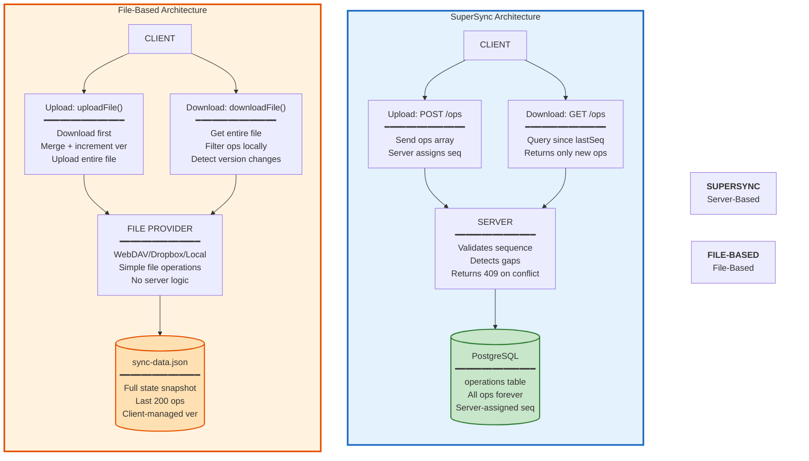
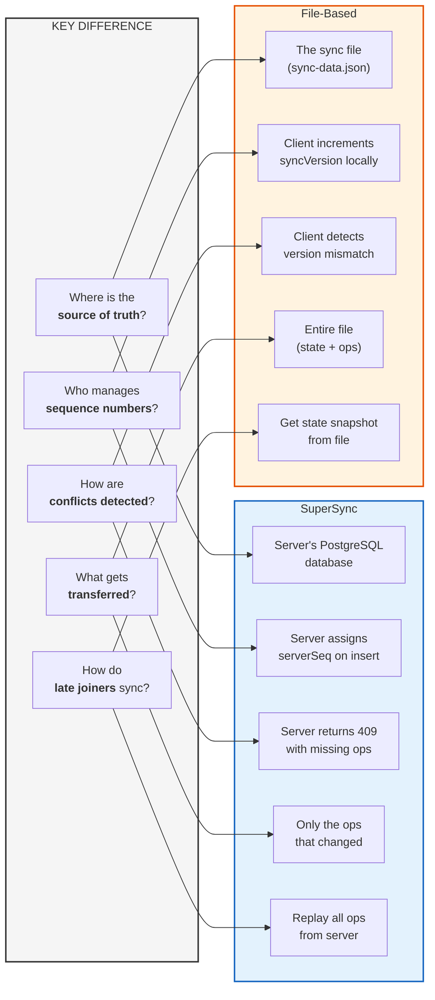
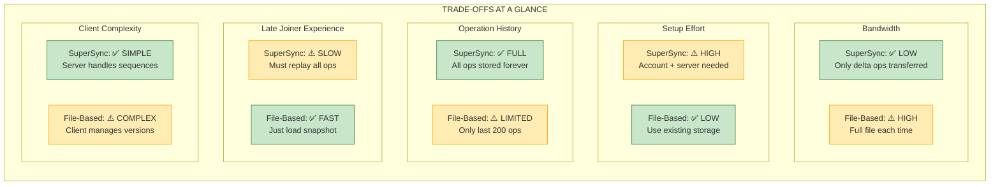
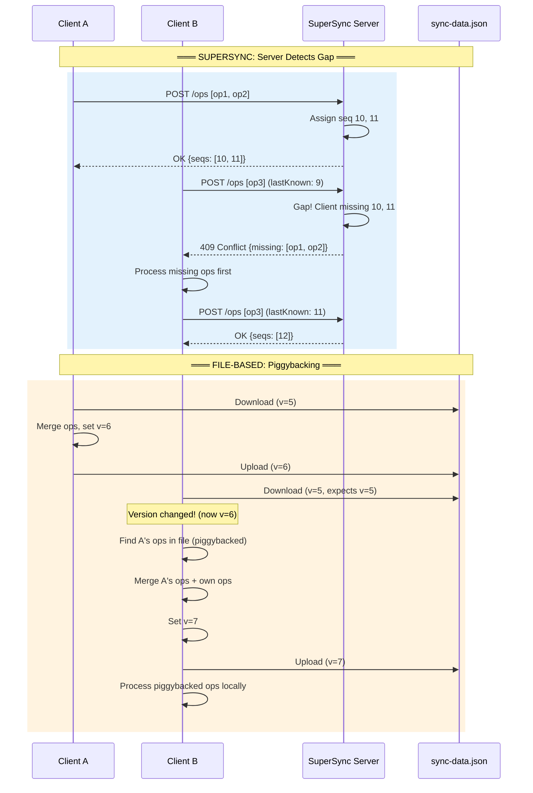
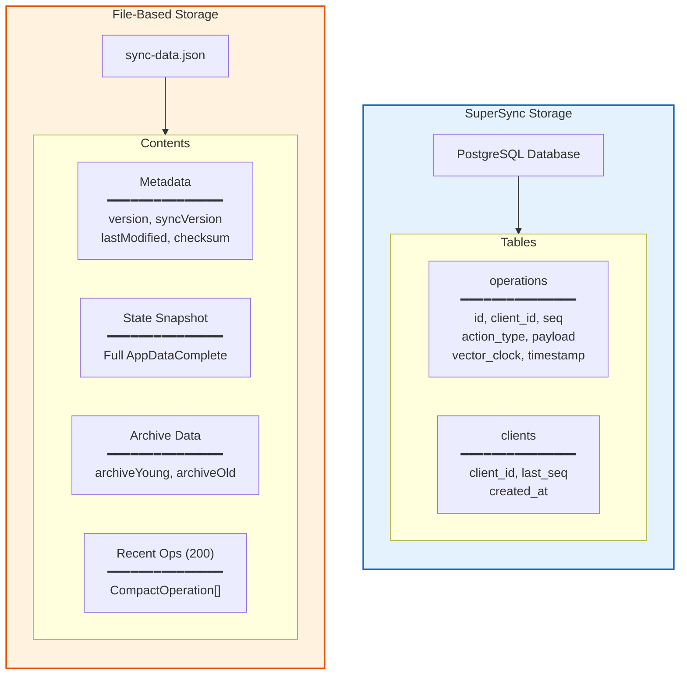
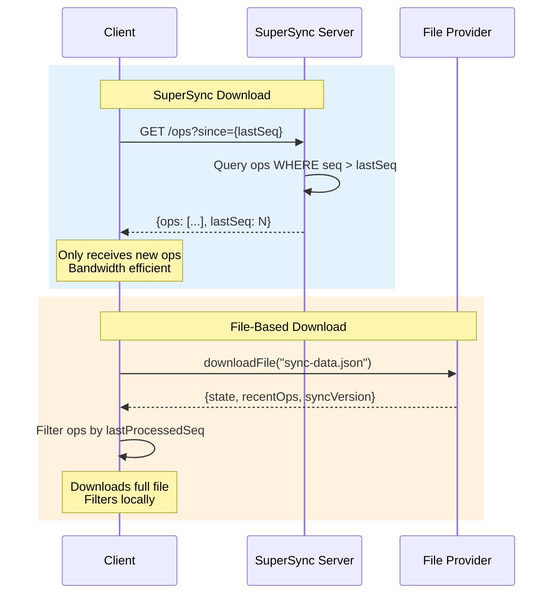
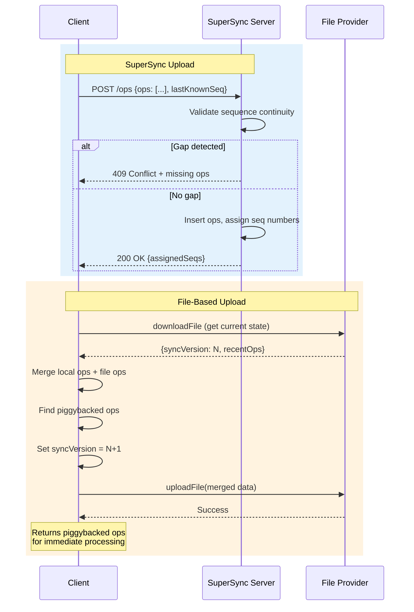
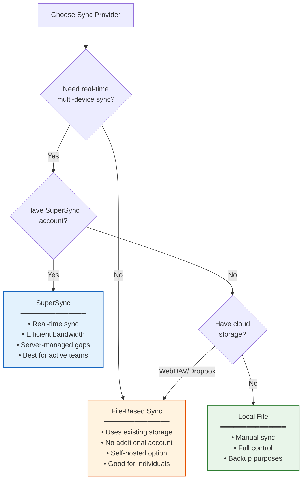

# SuperSync 与文件同步对比

**最后更新：** 2026 年 1 月  
**状态：** 已实现

本文对比两种同步 Provider 架构：SuperSync（服务端模式）与 File-Based（WebDAV/Dropbox/LocalFile）。

## 并排架构图

## 概念层核心差异

## 详细特性对比

| 维度                 | SuperSync                | File-Based                   | 优势方     |
| -------------------- | ------------------------ | ---------------------------- | ---------- |
| **带宽效率**         | 仅传输变化操作           | 每次传输整文件               | SuperSync  |
| **接入复杂度**       | 需要账号 + 服务端        | 可直接用现有云存储           | File-Based |
| **离线时长**         | 理论无限（服务端保全量） | 有上限（仅保留最近 200 ops） | SuperSync  |
| **自托管门槛**       | 需运行服务端             | 只需文件存储                 | File-Based |
| **新设备首同步速度** | 慢（需回放全量 ops）     | 快（直接读快照）             | File-Based |
| **冲突处理**         | 服务端主导               | 客户端 piggybacking          | 平局       |
| **实时同步能力**     | 有（轮询/webhook）       | 无（周期同步）               | SuperSync  |
| **数据恢复能力**     | 全量 op 历史             | 快照 + 最近 200 ops          | SuperSync  |

## 权衡可视化

## 并发编辑场景对比

## 数据存储结构对比

## 同步流程对比

### 下载流程

### 上传流程

## 冲突处理对比

```mermaid
flowchart TB
    subgraph SuperSync["SuperSync Conflict Handling"]
        SS1["Client uploads ops"]
        SS2{"Server checks<br/>sequence gap?"}
        SS3["Gap: Return 409<br/>+ missing ops"]
        SS4["No gap: Accept ops"]
        SS5["Client downloads<br/>missing ops"]
        SS6["LWW resolution<br/>on client"]

        SS1 --> SS2
        SS2 -->|Yes| SS3
        SS2 -->|No| SS4
        SS3 --> SS5
        SS5 --> SS6
    end

    subgraph FileBased["File-Based Conflict Handling"]
        FB1["Client downloads file"]
        FB2{"syncVersion<br/>changed?"}
        FB3["Version match:<br/>Clean upload"]
        FB4["Version changed:<br/>Piggybacking"]
        FB5["Merge all ops"]
        FB6["Upload merged file"]
        FB7["Return piggybacked ops"]
        FB8["LWW resolution<br/>on client"]

        FB1 --> FB2
        FB2 -->|No| FB3
        FB2 -->|Yes| FB4
        FB4 --> FB5
        FB5 --> FB6
        FB6 --> FB7
        FB7 --> FB8
    end

    style SuperSync fill:#e3f2fd,stroke:#1565c0,stroke-width:2px
    style FileBased fill:#fff3e0,stroke:#e65100,stroke-width:2px
```

## 何时选哪种

## 实现细节

### 共享基础设施

两类 Provider 都实现 `OperationSyncCapable`，并共用：

| 组件                        | 作用                   |
| --------------------------- | ---------------------- |
| `OperationLogSyncService`   | 同步时机与流程编排     |
| `ConflictResolutionService` | 并发编辑的 LWW 解决    |
| `VectorClockService`        | 所有操作的因果追踪     |
| `OperationApplierService`   | 将远端 ops 应用到 NgRx |
| `ArchiveOperationHandler`   | 归档副作用处理         |

### Provider 专属组件

| SuperSync              | File-Based                    |
| ---------------------- | ----------------------------- |
| `SuperSyncProvider`    | `FileBasedSyncAdapter`        |
| REST API client        | 文件 Provider 抽象层          |
| 服务端序列号管理       | 客户端 syncVersion 跟踪       |
| 通过 HTTP 409 检测 gap | 通过版本不一致做 piggybacking |

## 关键文件

| 文件                                                 | 作用                    |
| ---------------------------------------------------- | ----------------------- |
| `src/app/op-log/sync-providers/super-sync/`          | SuperSync Provider 实现 |
| `src/app/op-log/sync-providers/file-based/`          | 文件型适配器与类型定义  |
| `src/app/op-log/sync/operation-log-sync.service.ts`  | 共享同步编排            |
| `src/app/op-log/sync/conflict-resolution.service.ts` | LWW 冲突解决            |
