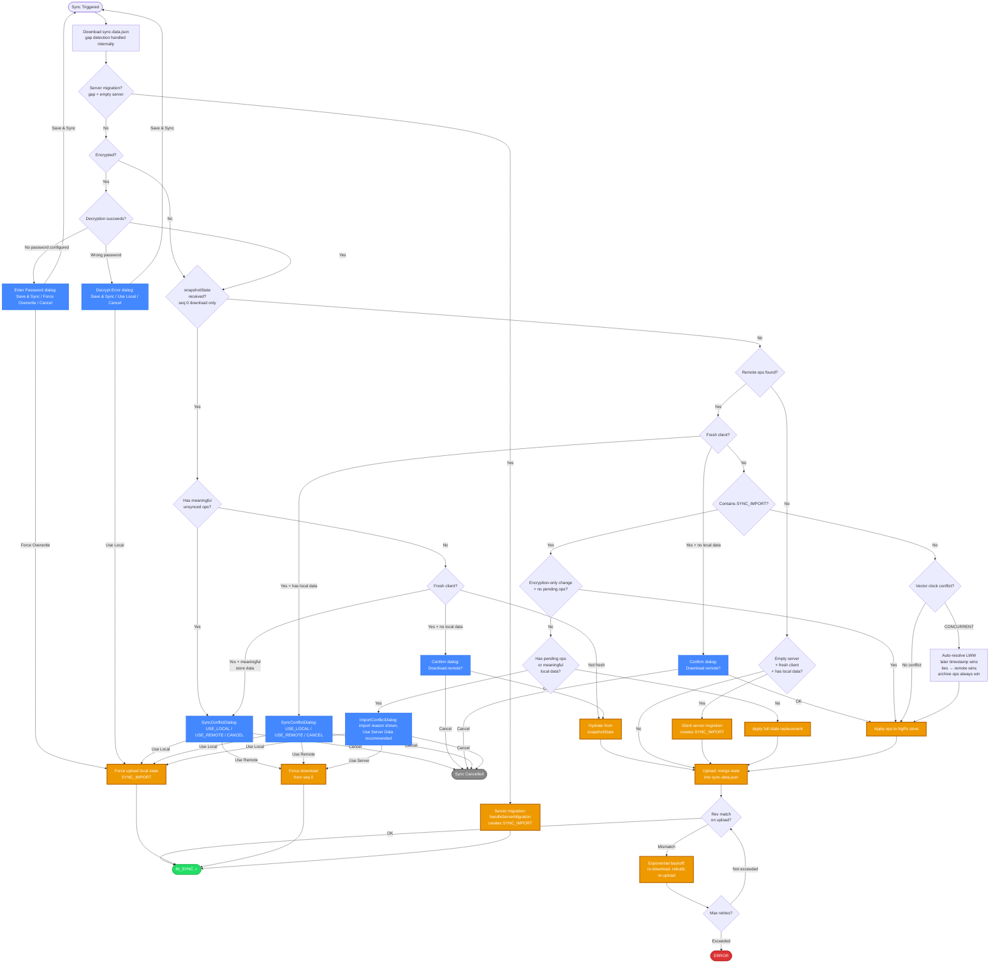
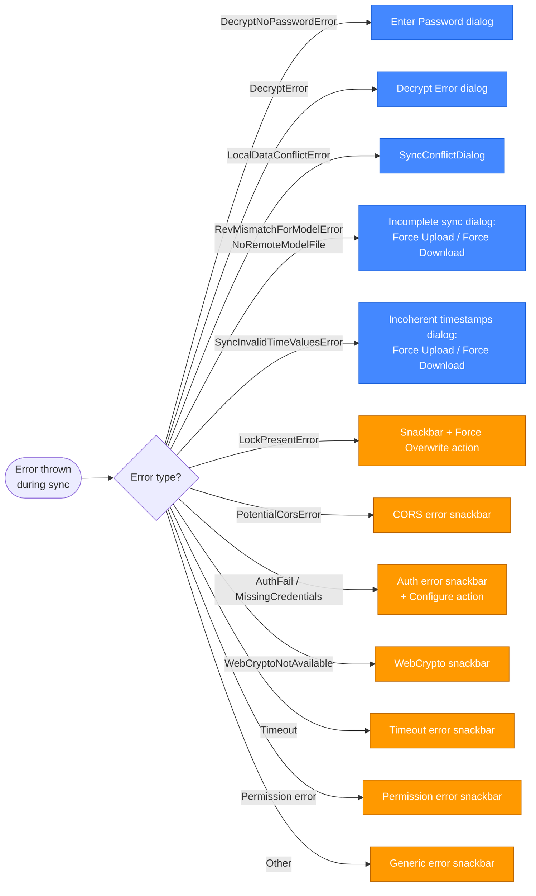

# 文件型同步流程图（Mermaid）

该图展示文件型 Provider（Dropbox、WebDAV、LocalFile）的同步决策树。SuperSync 对应流程见 [supersync-scenarios-flowchart.md](./supersync-scenarios-flowchart.md)。

两者共享同一套 op-log 基础设施（`OperationLogSyncService`、`RemoteOpsProcessingService`、冲突检测），差异主要在传输层/适配器层。

## 错误处理（SyncWrapperService）

同步期间抛出的错误由 `SyncWrapperService._sync()` 捕获。文件型 Provider 会暴露一些 SuperSync 不会出现的错误类型：

**图例：**

- 🟢 绿色 = 成功状态
- 🔴 红色 = 错误状态
- 🔵 蓝色 = 面向用户的对话框
- 🟠 橙色 = 关键动作（状态变更、上传、下载）
- ⚫ 灰色 = 取消/禁用

## 与 SuperSync 的主要差异

| 维度               | File-Based（Dropbox/WebDAV/LocalFile）                                                                                  | SuperSync                             |
| ------------------ | ----------------------------------------------------------------------------------------------------------------------- | ------------------------------------- |
| **传输方式**       | 下载/上传单个 `sync-data.json` 文件                                                                                     | 分页 API（服务端 op log）             |
| **快照路径**       | seq=0 下载会带完整 `snapshotState`，且有独立冲突分支                                                                    | 无快照概念，全部增量 ops              |
| **Gap 检测**       | 适配器检测 syncVersion 重置/快照替换/部分裁剪 → 从 seq=0 重拉                                                           | 服务端内部处理 gap                    |
| **服务端迁移**     | 空服务器 gap → `needsFullStateUpload` → `handleServerMigration()`                                                       | 同概念，不同触发机制                  |
| **上传重试**       | 基于 rev（ETag）匹配 + 指数退避抖动                                                                                     | 服务端拒绝码（`CONFLICT_CONCURRENT`） |
| **Piggybacking**   | 不适用（无服务端 piggyback）；并发变更在重试重下载时发现                                                                | 上传响应直接返回 piggybacked ops      |
| **同步后加密提示** | 不适用                                                                                                                  | 会提示设置密码或关闭同步              |
| **文件型特有错误** | `RevMismatchForModelError`、`NoRemoteModelFile`、`SyncInvalidTimeValuesError`、`LockPresentError`、`PotentialCorsError` | 不适用                                |

## 备注

- `Enter Password` 与 `Decrypt Error` 分别对应 `DecryptNoPasswordError` 和 `DecryptError`，是两个不同组件，选项也不同。
- `Encryption-only change` 旁路：当 incoming `SYNC_IMPORT` 的 `syncImportReason === 'PASSWORD_CHANGED'` 且没有有意义 pending ops 时，跳过冲突对话框（数据相同，仅加密状态变化）。
- LWW 平局规则：时间戳相同则 remote 胜。`moveToArchive` 无论时间戳都优先胜出。
- Gap 检测触发：
  1. syncVersion 重置（其他客户端上传快照导致计数器重置）
  2. 快照替换（`recentOps` 为空但有 `state` 且 `clientId` 变化）
  3. 部分裁剪（`oldestOpSyncVersion > sinceSeq` 且缓冲区已满）
- 上传重试公式：`base × 2^(attempt-1) + random(0..50%)`，最大重试次数由 `FILE_BASED_SYNC_CONSTANTS.MAX_UPLOAD_RETRIES` 控制。

## 关键源码文件

| 文件                                                                          | 角色                                          |
| ----------------------------------------------------------------------------- | --------------------------------------------- |
| `src/app/imex/sync/sync-wrapper.service.ts`                                   | 顶层编排 + 错误处理                           |
| `src/app/op-log/sync/operation-log-sync.service.ts`                           | 下载/上传编排、新客户端检测、SYNC_IMPORT 处理 |
| `src/app/op-log/sync/operation-log-download.service.ts`                       | 下载与内部 gap 检测                           |
| `src/app/op-log/sync-providers/file-based/file-based-sync-adapter.service.ts` | 文件适配器（rev 匹配、gap 检测、快照上传）    |
