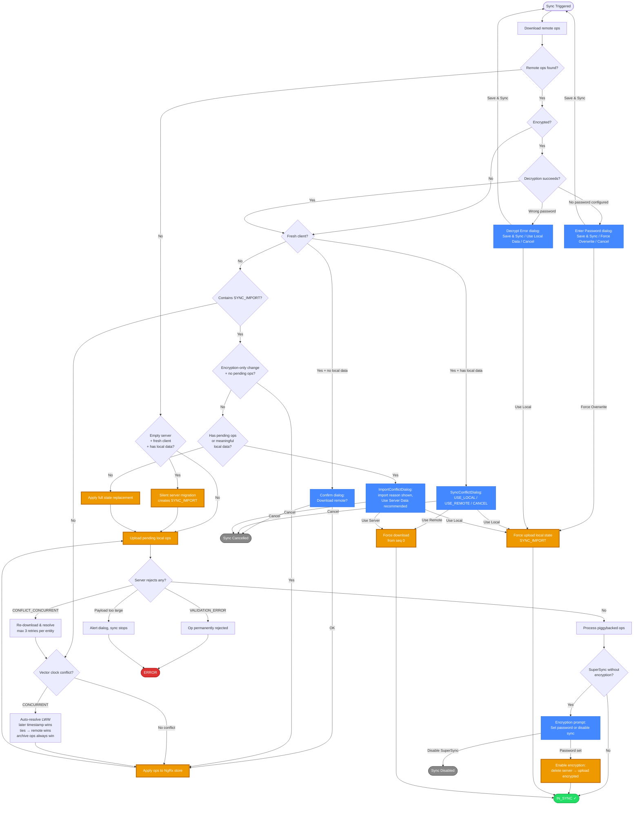

# SuperSync 同步流程图（Mermaid）

该图展示主同步决策树。完整细节见 [supersync-scenarios.md](./supersync-scenarios.md)。

**图例：**

- 🟢 绿色 = 成功状态
- 🔴 红色 = 错误状态
- 🔵 蓝色 = 用户可见对话框
- 🟠 橙色 = 关键动作（状态变更、上传、下载）
- ⚫ 灰色 = 取消/禁用

**备注：**

- `Enter Password` 与 `Decrypt Error` 分别对应 `DecryptNoPasswordError` 与 `DecryptError`，是不同组件，选项不同。
- `Encryption-only change` 旁路：当入站 SYNC_IMPORT 的 `syncImportReason === 'PASSWORD_CHANGED'` 且无有意义 pending ops 时，跳过冲突对话框（数据没变，只是加密状态变了）。
- LWW 平局规则：时间戳相同 remote 胜（服务端权威）。`moveToArchive` 无论时间戳都胜出。
- 重下载重试上限：每个实体最多 3 次（`MAX_CONCURRENT_RESOLUTION_ATTEMPTS`），超限后操作会被永久拒绝。
